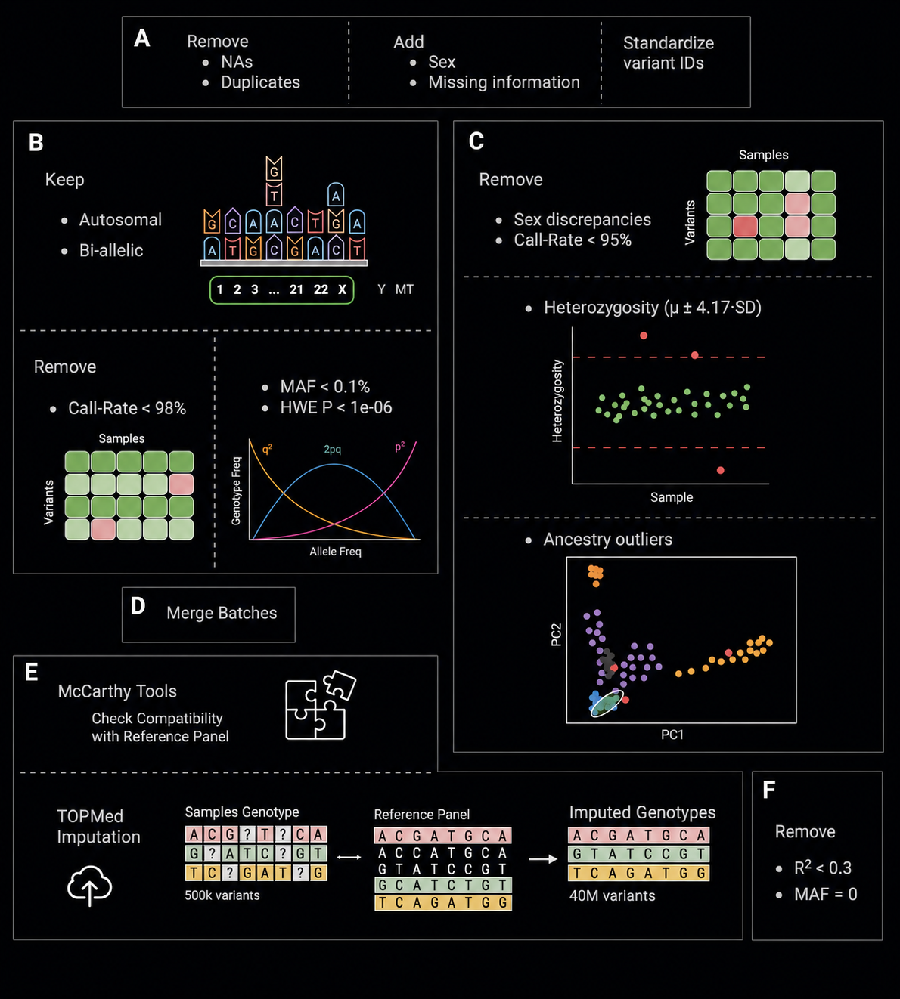

<div id="home">

<div class="hero-figure">
  
  
</div>
<div class="hero-caption">
  <strong>Genotype imputation pipeline.</strong> (A) Dataset pre-processing. (B) Variant-level quality control. (C) Sample-level quality control. (D) Merging of individually quality-controlled batches. (E) TOPMed imputation after verification of dataset’s format and compatibility using McCarthy tools. (F) Post-imputation quality control.
</div>
<p>This documentation describes a reproducible genotype imputation workflow: pre-imputation quality control on array genotypes, harmonization and merging of five study batchs, TOPMed imputation, and post-imputation filtering. The primary study batch started with <strong>336 samples</strong> and <strong>730,059 variants</strong>; after QC and imputation the merged upload contained <strong>2,113 samples</strong> and <strong>534,550 variants</strong>, yielding <strong>40,557,520</strong> imputed variants genome-wide.</p>

</div>
## Pipeline Overview {#pipeline-overview-brief}

This pipeline processes array genotypes through four stages:

1. **Pre-imputation QC** — variant and sample filtering, ancestry checks, and McCarthy harmonization against the TOPMed reference panel
2. **Merge** — harmonize chromosome naming and variant IDs across five numbered cohorts, then merge per chromosome
3. **Imputation** — upload merged VCFs to the TOPMed Imputation Server (TOPMed r3 reference, GRCh38)
4. **Post-imputation QC** — filter on MAF > 0 and imputation R² ≥ 0.3

### Prerequisites

Set a project root at the start of each session:

```bash
export PROJECT_ROOT=/path/to/your/project
```

**Required software:** PLINK 2, PLINK 1.9, bcftools, tabix, R (ggplot2), UCSC liftOver, McCarthy `HRC.pl`, aria2c (for large downloads).

Plot assets referenced in this document live under `figures/` (relative to the rendered site).

### Cohort Mapping

| Code | Role | Samples |
|------|------|---------|
| `cohort-01` | External control panel | 1,036 |
| `cohort-02` | Family study | 374 |
| `cohort-03` | Prior batch A | 267 |
| `cohort-04` | Prior batch B | 126 |
| `cohort-05` | Primary study (current) | 310 |
| **Total merged** | | **2,113** |

## Directory Structure {#directory-structure}

### cohort-05 (primary study)

```markdown
$PROJECT_ROOT/cohort-05/ 
├── 00-raw-genotypes/
│   ├── metadata/
│   │   ├── site-a-phenotype.csv
│   │   └── site-b-phenotype.csv
│   ├── plink-v38-files/
│   │   ├── filter-lists/
│   │   ├── logs/
│   │   ├── OGs/
│   │   ├── plink-data/
│   │   └── scripts/
│   ├── reports/
│   ├── zips/
│   └── README
├── 01-qc-pre-imputation/
│   ├── 00-plink2-files/
│   ├── 01-SNPs/
│   │   ├── logs/
│   │   └── plink-data/
│   ├── 02-Samples/
│   │   ├── filter-lists/
│   │   ├── logs/
│   │   ├── PCA/
│   │   ├── plink-data/
│   │   ├── plots/
│   │   ├── scripts/
│   │   └── stats/
│   └── 03-McCarthy/
│       ├── mccarthy-output/
│       ├── input-data/
│       ├── logs/
│       ├── plink-updated/
│       └── vcf-files/
```

### vcf-to-impute

```markdown
$PROJECT_ROOT/vcf-to-impute/ 
├── samples.txt
├── update-chr.txt
├── dup-ids.txt
├── cohort-01/
├── cohort-02/
├── cohort-03/
├── cohort-04/
├── cohort-05/
└── to-impute/
```

### TOPMed-imputed

```markdown
$PROJECT_ROOT/TOPMed-imputed/ 
├── samples.txt
├── README
├── 01-stats/
├── 02-post-imputation-qc/
│   ├── info/   
│   │   └── chr[1-22,X].info.gz
│   └── vcf/
│       ├── chr[1-22,X].filtered.dose.vcf.gz
│       └── chr[1-22,X].filtered.dose.vcf.gz.csi
```

## Pre-Imputation QC Summary {#pre-imputation-qc-summary}

This section summarizes the workflow and parameters used throughout the pre-imputation QC pipeline for the primary study batch (`cohort-05`).

**Data Preparation & Cleaning**

- **Samples Excluded:** 6 internal controls (`NA` array prefix) and 1 ambiguous duplicate IID were removed.
- **Sex Updates:** Missing sex information was imputed from clinical phenotype files.
- **Variant IDs:** All variant IDs standardized to `chr<N>:<pos>:<REF>:<ALT>`.
- **Conversion:** Datasets were converted from PLINK1 to PLINK2 format.

**Variant Quality Control (SNP QC)**

- **Chromosome Filter:** Retained only autosomal (Chr 1-22) and Chr X variants.
- **Allelic Filter:** Confined variants to strictly biallelic loci (`--min-alleles 2 --max-alleles 2`).
- **Duplicate Removal:** Excluded variants with mismatched duplicate IDs (`--rm-dup exclude-mismatch`).
- **Missingness (Call-rate):** Filtered out variants with >2% missingness (`--geno 0.02`).
- **Minor Allele Frequency (MAF):** Removed very rare or monomorphic alleles with MAF < 0.1% (`--maf 1e-3`).
- **Hardy-Weinberg Equilibrium (HWE):** Excluded variants deviating from HWE with p-value < 1×10⁻⁶ (`--hwe 1e-6`).

*Result:* 730,059 initial variants reduced to 532,037 high-quality variants.

**Sample Quality Control**

- **Missingness (Call-rate):** Samples with >5% missingness would be removed (`--mind 0.05`), though none failed.
- **Heterozygosity:** 5 samples with excessive homozygous/heterozygous calls beyond `µ ± 4.17·SD` (Bonferroni-adjusted F coefficient) were removed.
- **Sex Discrepancies:** Validated reported sex using chrX F-statistic. Thresholds: `F < 0.2` (female) and `F > 0.8` (male). 1 problematic mismatch was removed, 8 NA updated.
- **Ancestry (PCA):** Conducted PCA against 1000 Genomes reference (after liftOver to GRCh37). Removed 14 genetic outliers based on Mahalanobis distance > 9.21 (χ² = 9.21, 99% CI).

*Result:* 336 initial samples cleaned to 310 well-characterized samples. 

**Final Preparation & McCarthy QC**

- **Monomorphic Check:** Any variants driven to monomorphic state post-sample removal were pruned (`--mac 1`).
- **McCarthy QC (`HRC.pl`):** Validated strand, positions, ambiguity, and REF/ALT alleles against the TOPMed reference panel, generating final cleaned, per-chromosome `.vcf` files.

*Final Output:* 310 samples and 494,949 variants ready for TOPMed imputation.

## Exploratory Analysis

Inspect the raw PLINK1 binary files to understand the dataset's size, structure, and any data quality issues that need to be addressed before proceeding.

### Set Up Working Directory

```bash
# Unzip and rename the raw PLINK1 binary files into a clean working directory.

cd $PROJECT_ROOT/cohort-05/00-raw-genotypes

mkdir plink-v38-files
unzip zips/cohort-05-plink-v38.zip -d plink-v38-files/ && cd plink-v38-files/

# Standardize file prefix across all extensions
for file in *; do mv "$file" "cohort-05-plink1-v38.${file##*.}"; done
```

### Inspect the `.log` File

```bash
# Get a quick summary of sample/variant counts and any warnings from the genotyping array.

less -S cohort-05-plink1-v38.log
```

::: minimal-output
**Output (key fields):**

- Samples: **336** (0 females, 0 males, 336 ambiguous)
- Variants: **730,059**
- Genotyping rate: **0.903162**
- No phenotypes present — all samples are disease cases
:::

::: minimal-warning
**Warning**

`Nonmissing nonmale Y chromosome genotype(s) present`  
Since no sex is recorded in the `.fam` file, PLINK treats all 336 samples as non-male. Y-chromosome genotypes found for these samples trigger this warning. This will be resolved in [Add Sex Information](#add-sex-information-to-the-samples).
:::

### Inspect the `.fam` File (Sample Information)

```bash
# Examine sample IDs, sex coding, and phenotype fields.

less -S cohort-05-plink1-v38.fam
```

> **File format** (space-delimited, no header):

```text
FID           IID            PID   MID  SEX  PHENOTYPE
<int>-<int>   <PREFIX><int>  0     0    0    -9
```

> **Key findings:**
>
> - `SEX = 0` for all samples — sex information is missing and must be added from clinical data (see [Add Sex Information](#add-sex-information-to-the-samples))
> - `PHENOTYPE = -9` — missing, as expected (all samples are cases)

```bash
# Check for duplicate sample IDs (column 2 = IID).

awk '{print $2}' cohort-05-plink1-v38.fam | sort | uniq -d
```

::: minimal-output
**Output:** No duplicate IIDs detected.
:::

```bash
# Count samples per cohort prefix to verify expected group sizes.

for prefix in A B C NA; do
    count=$(awk -v p="^$prefix" '$2 ~ p' cohort-05-plink1-v38.fam | wc -l)
    echo "$prefix: $count"
done
```

::: minimal-output
**Output:**

| Prefix | Count | Site |
|--------|-------|------|
| A      | 241   | Site B (case group) |
| B      | 83    | Site A |
| C      | 6     | Site C |
| NA     | 6     | Genotyping array controls — **must be removed** |
:::

::: minimal-warning
**Action required (NA samples)**

The 6 `NA` samples (3 unique IDs + 3 `_DUP1` duplicates) are internal controls from the genotyping array and must be excluded before analysis (see [Clean `.fam` File](#clean-.fam-file)).
:::

::: minimal-note
**Note (Duplicate sample)**

One FID carries two IIDs in a single `.fam` row, indicating the same individual was recorded under two study prefixes. Only one IID is retained as a single biological entity; both phenotypes are recorded in a separate phenotype file for downstream analysis (see [Resolve Duplicate IID](#resolve-duplicate-iid-for-duplicate-sample)).
:::


### Inspect the `.bim` File (Variant Information)

```bash
# Check variant ID formats — these must be standardized before imputation.

less -S cohort-05-plink1-v38.bim
```

::: minimal-output
**Key findings:** The ID column (column 2) has inconsistent formats:

- `chr<N>:<pos>` or `<N>:<pos>` (positional, no alleles)
- `rs<int>` (dbSNP rsID)
- `ilmnseq_rs<int>` (Illumina probe ID)
- CNV, `Ilmndup`, R/A, GSA tags
:::

::: minimal-warning
**Action required**

All variant IDs must be standardized to `chr<N>:<pos>:<REF>:<ALT>` for compatibility with the TOPMed Imputation Server (see [Normalize Variant IDs](#normalize-variant-ids-to-chrnposrefalt)).
:::

### Inspect the `.nosex` File (Missing Sex)

```bash
# Confirm which samples are missing sex information.

less -S cohort-05-plink1-v38.nosex
```

::: minimal-output
**Output:** **336 samples** — all samples are listed (sex is missing for all).  
:::

::: minimal-warning
**Action required**

Sex must be imputed from the clinical phenotype files (`site-a-phenotype.csv`, `site-b-phenotype.csv`) — see [Add Sex Information](#add-sex-information-to-the-samples).
:::

## File Prep

### Clean `.fam` File

Two issues identified in [Inspect the `.fam` File](#inspect-the-.fam-file-sample-information) must be resolved before converting to PLINK2 format: removal of genotyping controls (NA samples) and correction of the duplicate IID in one sample row.

::: minimal-note
**Note**

Originals are preserved unmodified in `plink-v38-files/OGs/`.
:::


#### Remove Genotyping Array Controls (NA Samples)

PLINK does not support direct removal of rows from a `.fam` file; instead, a sample exclusion list is passed to `--remove` at the conversion step ([Create PLINK2 Binary Files](#create-plink2-binary-files)).

```bash
# Extract FID + IID for all NA-prefixed samples into the exclusion list
awk '$2 ~ /^NA/ {print $1 "\t" $2}' cohort-05-plink1-v38.fam > filter-lists/samples-to-remove.txt

# Verify: should contain exactly 6 entries
wc -l filter-lists/samples-to-remove.txt
```

::: minimal-output
**Output:** 6 lines — 3 `NA` IDs and their 3 `_DUP1` counterparts confirmed.
:::

#### Resolve Duplicate IID for Duplicate Sample

One sample carries two IIDs in a single `.fam` row, which PLINK cannot parse. Only the retained IID is kept; both phenotypes are tracked in a separate phenotype file for downstream analysis.

```bash
# Manually edit the duplicate row to remove the secondary IID prefix, keeping only <retained-iid>
vi cohort-05-plink1-v38.fam
```

::: minimal-note
**Why a single IID?**

A duplicated row for the same biological sample would introduce artificial relatedness (IBD), distort allele frequencies, and cause a fatal PLINK error (`.fam` row count must match the `.bed` genotype matrix exactly).
:::


### Add Sex Information to the Samples

Sex is missing for all samples (see [Inspect the `.nosex` File](#inspect-the-.nosex-file-missing-sex)). It is sourced from the clinical phenotype files (`site-a-phenotype.csv`, `site-b-phenotype.csv`) and added via one of two approaches below. Both produce identical output; **the first approach is the canonical one**.

::: minimal-note
**Note**

Clinical phenotype sex coding: `1 = Male`, `2 = Female`. Samples with no value in the source file are set to `0` (unknown).
:::


#### Generate Sex File for `plink2 --update-sex`

This approach produces a standalone sex file (`cohort-05-sex.txt`) used as input to PLINK2's `--update-sex` flag at the conversion step ([Create PLINK2 Binary Files](#create-plink2-binary-files)).

```bash
# Extract FID and IID from the .fam file
awk '{print $1 "\t" $2}' cohort-05-plink1-v38.fam > temp-ids.txt

# Extract sample ID and sex from both clinical phenotype files (skip header with NR>1)
awk -F',' 'NR>1 {print $1 "\t" $4}' ../metadata/site-a-phenotype.csv  > temp-sex.txt
awk -F',' 'NR>1 {print $1 "\t" $4}' ../metadata/site-b-phenotype.csv >> temp-sex.txt

# Join files via awk: match IIDs to sex values, output FID + IID + SEX
awk -f scripts/create-sex-file.awk -v OFS='\t' temp-sex.txt temp-ids.txt > filter-lists/cohort-05-sex.txt
```

**Script — `scripts/create-sex-file.awk`:**

```awk
# Usage: awk -f create-sex-file.awk -v OFS='\t' temp-sex.txt temp-ids.txt > cohort-05-sex.txt

# Pass 1: load sex mapping from temp-sex.txt
NR==FNR {
    sex[$1] = $2
    next
}

# Pass 2: match IIDs; assign 0 (unknown) if no sex entry found
{
    print $1, $2, ($2 in sex && sex[$2] != "") ? sex[$2] : 0
}
```

```bash
# Verify output format
less -S filter-lists/cohort-05-sex.txt
```

::: minimal-output
**Expected output** (tab-delimited, no header):

```text
FID           IID            SEX
<int>-<int>   <PREFIX><int>  <1|2|0>
```
:::

```bash
# Identify samples with unknown sex (SEX = 0) and cross-check against source files
awk '$3 == 0 {print $2}' filter-lists/cohort-05-sex.txt \
    | grep -f - ../metadata/site-a-phenotype.csv ../metadata/site-b-phenotype.csv
```

::: minimal-output
**Output:** 14 samples have `SEX = 0` — all are from site B with a missing or empty sex field in `site-b-phenotype.csv`.
:::

```bash
# Remove temporary files (optional)
# rm temp-ids.txt temp-sex.txt
```

#### Alternative: Update the `.fam` File Directly

::: minimal-note
**Note**

Performed in `plink-v38-files/scripts/alternate-sex-update/`. Produces the same 14 unknowns, it's just an alternative approach.
:::


```bash
# Extract sex mapping from clinical phenotype files
awk -F',' 'NR>1 {print $1 "\t" $4}' ../../../metadata/site-a-phenotype.csv  > temp-sex-mapping.txt
awk -F',' 'NR>1 {print $1 "\t" $4}' ../../../metadata/site-b-phenotype.csv >> temp-sex-mapping.txt

# Rewrite the .fam file with updated sex column (col 5)
awk -f update-sex.awk -v OFS='\t' temp-sex-mapping.txt cohort-05-plink1-v38.fam > temp.fam

# Overwrite original and clean up (optional)
mv temp.fam cohort-05-plink1-v38.fam
# rm temp-sex-mapping.txt
```

**Script — `scripts/update-sex.awk`:**

```awk
# Usage: awk -f update-sex.awk -v OFS='\t' temp-sex-mapping.txt file.fam > final.fam

# Pass 1: load sex mapping
NR==FNR {
    sex_map[$1] = $2
    next
}

# Pass 2: update column 5 (SEX); default to 0 if not found
{
    $5 = ($2 in sex_map && sex_map[$2] != "") ? sex_map[$2] : "0"
    print $1, $2, $3, $4, $5, $6
}
```


### Normalize Variant IDs

Variant IDs in the raw `.bim` file have inconsistent formats (see [Inspect the `.bim` File](#inspect-the-.bim-file-variant-information)). All IDs are standardized to `chr<N>:<pos>:<REF>:<ALT>` using PLINK2's `--set-all-var-ids` flag, applied at the conversion step ([Create PLINK2 Binary Files](#create-plink2-binary-files)).

The required fields are already present in the `.bim` file:

| `.bim` column | Content | Notes |
|---|---|---|
| 1 | Chromosome | GRCh38 — must include `chr` prefix (TOPMed requirement) |
| 4 | Position | |
| 5 | Alternate allele | `.bim` stores ALT before REF; order is **flipped** in the new ID |
| 6 | Reference allele | |

::: minimal-note
**Why `<REF>:<ALT>` order?**

TOPMed Imputation Server requires this format. Major databases (dbSNP, Varsome) also use `REF:ALT` by convention. The `.bim` file stores columns 5–6 as `ALT REF`, so the alleles are swapped when building the new ID.
:::


### Create PLINK2 Binary Files

Converts PLINK1 (`.bed/.bim/.fam`) to PLINK2 (`.pgen/.pvar/.psam`) format, simultaneously applying all filters generated in the file prep sections. PLINK2 format is preferred for computational efficiency and compatibility with modern pipelines.

Filter files used (from `filter-lists/`):

- `samples-to-remove.txt` — genotyping array controls ([Remove Controls](#remove-genotyping-array-controls-na-samples))
- `cohort-05-sex.txt` — sex assignments from clinical phenotype ([Generate Sex File](#generate-sex-file-for-plink2---update-sex), if `.fam` was not updated directly)

```bash
# Convert to PLINK2, removing controls, updating sex, and standardizing variant IDs
plink2 \
    --bfile cohort-05-plink1-v38 \
    --remove       filter-lists/samples-to-remove.txt \
    --update-sex   filter-lists/cohort-05-sex.txt \
    --set-all-var-ids chr@:#:\$r:\$a \
    --sort-vars \
    --make-pgen \
    --out cohort-05-plink2-v38
```

::: minimal-note
**If sex was already written to the `.fam` file**

([Alternative approach](#alternative-update-the-.fam-file-directly)), omit `--update-sex`.
:::


| Flag | Effect |
|---|---|
| `--bfile` | PLINK1 input prefix (`.bed` / `.bim` / `.fam`) |
| `--remove` | Exclude listed samples (FID + IID) |
| `--update-sex` | Overwrite sex column from external file |
| `--set-all-var-ids chr@:#:$r:$a` | Standardize all IDs to `chr<N>:<pos>:<REF>:<ALT>` |
| `--sort-vars` | Sort variants by chromosome and position |
| `--make-pgen` | Write PLINK2 binary output (`.pgen` / `.pvar` / `.psam`) |
| `--out` | Output file prefix |

```bash
# Verify sample and variant counts
less -S cohort-05-plink2-v38.log
```

::: minimal-output
**Output (key fields):**

- Samples: **330** (69 females, 253 males, 8 ambiguous; 330 founders)
- Variants: **730,059**
- No phenotype data present
:::

```bash
# Inspect output files
less -S cohort-05-plink2-v38.pvar   # variant info
less -S cohort-05-plink2-v38.psam   # sample info
```

> **`.pvar` format:**
>
> ```text
> #CHROM  POS      ID                        REF  ALT  CM
> <N>     <int>    chr<N>:<pos>:<REF>:<ALT>  <A>  <A>  0
> ```
>
> **`.psam` format:**
>
> ```text
> #FID          IID            SEX
> <int>-<int>   <PREFIX><int>  <1|2|0>
> ```

#### Organize Output Files

- PLINK1 and PLINK2 data files → `plink-v38-files/plink-data/`
- All `.log` files → `plink-v38-files/logs/`

## Pre-Imputation QC: SNPs

Filters applied in this section, in order:

| Step | Filter | Threshold | Rationale |
|------|--------|-----------|-----------|
| Chromosome scope | Chromosome scope | chr 1–22, X only | Remove chr 0, Y, XY, MT |
| Biallelic only | Biallelic only | `--min/max-alleles 2` | Imputation servers require biallelic loci |
| Duplicate variants | Duplicate variants | `--rm-dup exclude-mismatch` | Remove conflicting duplicate entries |
| Call-rate | Call-rate | `--geno 0.02` (< 98%) | Remove poorly genotyped variants |
| MAF | MAF | `--maf 1e-3` (< 0.1%) | Remove very rare and monomorphic variants |
| HWE | HWE | `--hwe 1e-6` | Remove variants deviating from equilibrium |

::: minimal-note
**QC order rationale**

Standard pipelines apply mild variant filtering first, then sample QC, then stringent variant QC. Given this cohort's small size (~300 samples), stringent SNP QC is applied upfront to minimize variant-driven sample exclusions. Sample retention is the primary objective.
:::


```bash
# Set up working directories and copy PLINK2 files from the conversion step
mkdir -p 01-qc-pre-imputation/plink2-files && cd 01-qc-pre-imputation
cp ../00-raw-genotypes/plink-v38-files/plink-data/cohort-05-plink2-v38.p* ./plink2-files/
mkdir SNPs && cd SNPs
```

### Keep Autosomal (chr 1–22), Chromosome X & Biallelic Variants

```bash
# Retain chr 1-22 and X; enforce exactly 2 alleles per variant
plink2 --pfile ../plink2-files/cohort-05-plink2-v38 \
    --chr 1-22,X \
    --min-alleles 2 --max-alleles 2 \
    --make-pgen --out cohort-05-plink2-v38.1-chr
```

::: minimal-output
**Output:** **174,738** variants removed → **555,321** remaining

- chr 0, Y, XY, MT removed: *7,927* variants
- Non-biallelic (`.` in REF or ALT): *171,552* variants (none were truly multiallelic; these were missing-allele entries from the array)
:::

::: minimal-note
**Note**

Monomorphic variants are intentionally not filtered here — further sample-level QC may alter their status. They are removed at the end of Sample QC at [Remove Monomorphic Variants](#remove-monomorphic-variants) via `--mac`.
:::


### Remove Duplicate Variants

Genotyping arrays can contain duplicate variant IDs from probe redundancy or batch merging. An initial run with `--rm-dup` reveals the extent of the problem before applying the appropriate resolution strategy.

```bash
# Initial attempt — expected to fail if mismatched duplicates are present
plink2 --pfile cohort-05-plink2-v38.1-chr --rm-dup --make-pgen --out cohort-05-plink2-v38.2-dup
```

::: minimal-warning
**Error**

`402 duplicate IDs with inconsistent genotype data detected; see .rmdup.mismatch`  
These 402 IDs appear more than once in `.pvar` and show conflicting genotypes across rows for at least one sample — most commonly a called genotype vs. a missing value (`NA`). Example:

```text
CHR  SNP                CM     POS       COUNTED  ALT  sample1  sampleX
1    chr1:18485682:G:A  33.22  18485682  G        A    1        NA
1    chr1:18485682:G:A  33.22  18485682  G        A    1        2
```
:::

Because mismatched duplicates represent only 402 variants (0.07% of 555,321), they are all excluded. These loci can be recovered during imputation.

```bash
# Exclude all mismatched duplicate IDs and log removed variant IDs
plink2 --pfile cohort-05-plink2-v38.1-chr \
    --rm-dup exclude-mismatch list \
    --make-pgen --out cohort-05-plink2-v38.2-dup
```

::: minimal-output
**Output:** 1,175 duplicated IDs, **1,745** variants removed → **553,576** remaining  
Full duplicate ID list: `cohort-05-plink2-v38.2-dup.rmdup.list`
:::

### Filter by Call-rate, MAF & HWE

Low-quality variants with a missingness rate exceeding 2% (i.e., missing in more than 2 out of 100 samples) are excluded. 
Monomorphic variants are also removed. However, to preserve potentially valuable rare variants given the small sample size of the batch, no additional stringent minor allele frequency filtering is applied. If the sample size is large enough a MAF < 1% or 5% is usually recommended. 
Finally, variants presenting significant deviations from expected Hardy-Weinberg Equilibrium genotype distributions are filtered out. 

| Flag | Threshold | Removes variants with |
|------|-----------|----------------------|
| `--geno 0.02` | Call-rate < 98% | > 2% missing genotypes across samples |
| `--maf 1e-3` | MAF < 0.1% | Monomorphic alleles |
| `--hwe 1e-6` | HWE p < 1×10⁻⁶ | Significant deviation from equilibrium |

```bash
plink2 --pfile cohort-05-plink2-v38.2-dup \
    --geno 0.02 --maf 1e-3 --hwe 1e-6 \
    --make-pgen --out cohort-05-plink2-v38.3-snp
```

::: minimal-output
**Output:**

- `--geno`: *21,366* variants removed
- `--hwe`: *44* variants removed
- `--maf`: *130* variants removed

**532,037** high-quality variants remaining.
:::

### SNP QC Summary

| Filter | Variants remaining |
|--------|--------------------|
| ***Initial*** | ***730,059*** |
| Autosomal + chrX + Biallelic | 555,321 |
| Duplicate variants removed | 553,576 |
| Call-rate < 98% | 532,210 |
| HWE p < 1×10⁻⁶ | 532,166 |
| MAF < 0.1% | 532,037 |
| ***Final*** | ***532,037*** |

### Organize SNP QC Output Files

- PLINK2 data files (per QC step) → `SNPs/plink-data/`
- `.log`, `.rmdup.list`, `.rmdup.mismatch` files → `SNPs/logs/`

## Pre-Imputation QC: Samples

Filters applied in this section, in order:

| Step | Filter | Threshold |
|------|--------|-----------|
| Call-rate | Call-rate | `--mind 0.05` (< 95%) |
| Heterozygosity | Heterozygosity | µ ± k·SD (Bonferroni-adjusted z-score) |
| Sex discrepancies | Sex discrepancies | chrX F-statistic thresholds (F < 0.2 female, F > 0.8 male) |
| Ancestry outliers | Ancestry outliers | PCA against 1000 Genomes reference |

```bash
# Set up working directory for sample QC
mkdir 02-Samples && cd 02-Samples
```

### Filter by Call-rate

All samples in this cohort were reported by the genotyping lab to have call-rate > 95%. After SNP QC, none fell below even the stricter 99% threshold (`--mind 0.01`).

```bash
plink2 --pfile ../01-SNPs/plink-data/cohort-05-plink2-v38.3-snp \
    --mind 0.05 \
    --make-pgen --out cohort-05-plink2-v38.1-call
```

::: minimal-output
**Output:** **0** samples removed.
:::

### Filter by Heterozygosity

The method-of-moments F coefficient estimates the inbreeding level per sample. Samples with abnormally high F (excess homozygosity; possible inbreeding or cryptic relatedness) or abnormally low F (excess heterozygosity; possible sample mix-up where DNA from multiple individuals was accidentally mixed) are excluded.

```bash
# Compute per-sample F coefficients (autosomal variants only)
plink2 --pfile cohort-05-plink2-v38.1-call --het --out rates
```

::: minimal-note
**Note**

21,552 chrX variants are automatically excluded by `--het` (autosomal only).
:::


**`.het` file columns:**

| Column | Description |
| `E(HOM)` | Expected homozygote count |
| `OBS_CT` | Number of non-missing variants used |
| `F` | Method-of-moments inbreeding coefficient |

> **Exclusion criteria:** µ ± k·SD, where k is the Bonferroni-adjusted z-score:
> 
> - `p = 0.01 / N = 0.01 / 330 = 3.03×10⁻⁵` → `k = z = 4.17`  
> - Samples with F outside [µ − 4.17·SD, µ + 4.17·SD] are flagged as outliers.

**Script `het-filter.R`**

```r
library(ggplot2)

# Load F coefficients
het_rates <- read.delim("rates.het")

# QQ-plot to assess normality
svg("plots/qqnorm-het.svg", width = 7, height = 7)
qqnorm(het_rates$F, col = "#1d3557", main = "QQ Plot of F Coefficient")
qqline(het_rates$F, col = "#e63946", lwd = 2)
dev.off()
# → F is approximately normally distributed; tails warrant inspection

# Compute Bonferroni-adjusted exclusion thresholds
N  <- nrow(het_rates)
k  <- qnorm(1 - (0.01 / N) / 2)   # two-sided Bonferroni z-score
lower_threshold <- mean(het_rates$F) - k * sd(het_rates$F)
upper_threshold <- mean(het_rates$F) + k * sd(het_rates$F)

# Flag and extract outliers
het_rates$Index   <- seq_len(N)
het_rates$outlier <- het_rates$F < lower_threshold | het_rates$F > upper_threshold
samples_to_exclude <- het_rates[het_rates$outlier, c("X.FID", "IID", "F")]

# Per-sample scatter plot with outlier labels
p2 <- ggplot(het_rates, aes(x = Index, y = F, color = outlier)) +
  geom_point() +
  geom_hline(yintercept = c(lower_threshold, upper_threshold),
             linetype = "dashed", color = "#e63946") +
  geom_text(data = subset(het_rates, outlier),
            aes(label = IID, vjust = ifelse(F > upper_threshold, -0.8, 1.8)),
            size = 3.5, show.legend = FALSE) +
  scale_color_manual(values = c("FALSE" = "#1d3557", "TRUE" = "#e63946")) +
  labs(title = "Per-sample F Coefficient", x = "Sample Index", y = "F") +
  theme_linedraw() +
  theme(legend.position = "bottom",
        plot.title = element_text(face = "bold", hjust = 0.5),
        panel.grid = element_blank())
ggsave("plots/per-sample-F-het.svg", p2, width = 10, height = 7)

# Export exclusion list for plink2 --remove
write.table(samples_to_exclude, "samples-by-het.txt",
            col.names = TRUE, row.names = FALSE, quote = FALSE, sep = "\t")
```

> 
>
> **Fig. 1:** *QQ plot assessing the normality of the inbreeding F coefficient distribution across all samples. The line represents the theoretical normal distribution.*

> 
>
> **Fig. 2:** *Scatter plot of per-sample F coefficients. Dashed red lines denote the Bonferroni-adjusted exclusion thresholds. Upper threshold: high homozygosity; Lower threshold: high heterozygosity*

> **Outliers identified (n=5):** 3 from prefix A, 1 from prefix B, 1 from prefix C

```bash
# Remove heterozygosity outliers
plink2 --pfile cohort-05-plink2-v38.1-call \
    --remove samples-by-het.txt \
    --make-pgen --out cohort-05-plink2-v38.2-het
```

::: minimal-output
**Output:** **325** samples remaining (67 females, 250 males, 8 ambiguous)
:::

### Filter by Sex Discrepancies

PLINK2's `--check-sex` estimates sex from the chrX inbreeding F-statistic and compares it against the reported sex. Expected ranges:

| Sex | chrX F | Genotype |
| Male | ≈ 1 | Hemizygous (XY) |
| Female | ≈ 0 | Heterozygous (XX) |

Samples are flagged as problematic if they fall in the ambiguous zone (0.2 ≤ F ≤ 0.8) or if their imputed sex conflicts with the reported sex.

#### Split Pseudo-Autosomal Regions (PARs)

PAR1 and PAR2 are homologous regions shared between X and Y chromosomes that behave autosomally. They must be relabelled before running `--check-sex` to avoid inflating the chrX F-statistic.

```bash
# Relabel PARs; verify no effect (no PAR variants present in this dataset)
plink2 --pfile cohort-05-plink2-v38.2-het --split-par hg38 --make-pgen --out x-pars

diff -s x-pars.pgen cohort-05-plink2-v38.2-het.pgen
diff -s x-pars.pvar cohort-05-plink2-v38.2-het.pvar
diff -s x-pars.psam cohort-05-plink2-v38.2-het.psam
```

::: minimal-output
**Output:** `--split-par` had no effect — no chrX variants fell within PAR1/PAR2 coordinates. All output files are identical to the input.
:::

#### Explore chrX F-statistic Distribution

Run `--check-sex` without thresholds to inspect the F-statistic distribution before committing to cutoffs.

```bash
plink2 --pfile cohort-05-plink2-v38.2-het --check-sex --out sex-rates
```

::: minimal-warning
**Warning**

No thresholds specified — PLINK2 defaults to `min-male-xf=1`, flagging 187 problems. This is expected; the default threshold is deliberately strict.
:::

::: minimal-warning
**Warning**

74 monomorphic variants skipped. These arise because sample-level removals (heterozygosity filtering) can drive already-rare variants (MAF ≈ 0.001) to zero frequency. They will be removed after all sample QC is complete.
:::

::: minimal-note
**Note**

Standard sex-check thresholds: **F > 0.8** (male), **F < 0.2** (female).
:::


**Script `sex-outliers.R`**

```r
library(ggplot2)

outliers <- read.delim("sex-outliers.sexcheck", na.strings = TRUE)
outliers$Index        <- seq_len(nrow(outliers))
outliers$Reported_Sex <- factor(outliers$PEDSEX,
                                levels = c(1, 2, "NA"),
                                labels = c("Male", "Female", "Unknown"))

# Classify outlier groups
ambiguous  <- subset(outliers, F >= 0.2 & F <= 0.8)
mismatched <- subset(outliers, (Reported_Sex == "Male" & F < 0.2) |
                               (Reported_Sex == "Female" & F > 0.8))
to_remove  <- rbind(ambiguous, mismatched)
na_samples <- subset(outliers, Reported_Sex == "Unknown")

# Export exclusion and sex-update lists
write.table(to_remove[, c("X.FID", "IID")],
            "samples-by-sex-R.txt", quote = FALSE, row.names = FALSE,
            col.names = FALSE, sep = "\t")
write.table(na_samples[, c("X.FID", "IID", "SNPSEX")],
            "na-sex-R.txt", quote = FALSE, row.names = FALSE,
            col.names = FALSE, sep = "\t")

# Labeled scatter plot
p1 <- ggplot(outliers, aes(x = Index, y = F, color = Reported_Sex)) +
  geom_point(alpha = 0.9, size = 2) +
  geom_hline(yintercept = c(0.2, 0.8), linetype = "dashed",
             color = "#e63946", linewidth = 0.5) +
  annotate("rect", xmin = -Inf, xmax = Inf, ymin = 0.2, ymax = 0.8,
           fill = "#e63946", alpha = 0.02) +
  annotate("text", x = Inf, y = 0.2, label = "0.2",
           hjust = 1.3, vjust = -0.5, size = 3, color = "#e63946") +
  annotate("text", x = Inf, y = 0.8, label = "0.8",
           hjust = 1.3, vjust = 1.5, size = 3, color = "#e63946") +
  geom_text(data = to_remove,  aes(label = IID), vjust = -1.5, size = 3,
            color = "black",  fontface = "bold", check_overlap = TRUE) +
  geom_text(data = na_samples, aes(label = IID), vjust =  2.5, size = 3,
            color = "gray50", fontface = "bold", check_overlap = TRUE) +
  scale_color_manual(values = c("Male" = "#021f59", "Female" = "#ff4103", "Unknown" = "gray50")) +
  labs(title = "ChrX F-Statistic Distribution",
       caption = c("Dashed lines: thresholds (0.2 / 0.8)",
                   "Black: sex mismatch/ambiguous  |  Gray: unknown (NA) reported sex"),
       x = "Sample Index", y = "F-statistic", color = "Reported Sex") +
  theme_linedraw() +
  theme(legend.position = "bottom",
        plot.title = element_text(face = "bold", hjust = 0.5),
        plot.caption = element_text(hjust = c(1, 0)),
        panel.grid = element_blank())

ggsave("plots/sexcheck-labeled.svg", plot = p1, width = 9, height = 7, dpi = 1200)
```

> 
>
> **Fig. 3:** *ChrX F-statistic distribution highlighting problematic samples. Samples with ambiguous or mismatched sex are labeled in black, and those with unknown reported sex are in gray.*

> All samples except one fall cleanly within the conventional thresholds — standard cutoffs (F < 0.2 female, F > 0.8 male) are appropriate for this dataset.

#### Identify Outliers and Assign Imputed Sex

Rerun `--check-sex` with the chosen thresholds to get the definitive problem list.

```bash
plink2 --pfile cohort-05-plink2-v38.2-het \
    --check-sex max-female-xf=0.2 min-male-xf=0.8 \
    --out sex-outliers
```

::: minimal-output
**Output:** 21,552 chrX variants scanned, **9 problems** detected.
:::

```bash
grep 'PROBLEM' sex-outliers.sexcheck
```

> **Problematic samples:**
>
> - **1 sample** — reported Female, imputed sex NA (F = 0.42, ambiguous zone) → **remove**
> - **8 samples** — reported sex NA → **assign imputed sex**
>   - *Imputed sex confirmed against clinical records for all 8 samples*

Generate exclusion/update lists (bash):

```bash
# Samples to remove: PROBLEM + reported sex is not NA
awk 'NR>1 && $5=="PROBLEM" && $3!="NA" {print $1"\t"$2}' sex-outliers.sexcheck > samples-by-sex.txt

# Samples to update: PROBLEM + reported sex is NA → assign imputed sex (col 4)
awk 'NR>1 && $5=="PROBLEM" && $3=="NA"  {print $1"\t"$2"\t"$4}' sex-outliers.sexcheck > na-sex.txt
```

```bash
# Confirm bash and R outputs are identical
diff -s samples-by-sex.txt samples-by-sex-R.txt
diff -s na-sex.txt na-sex-R.txt
```

::: minimal-output
**Output:** All files are identical.
:::

#### Remove Discrepant Samples & Update Missing Sex

```bash
# Assign imputed sex to NA samples; remove sex-discrepant sample
plink2 --pfile cohort-05-plink2-v38.2-het \
    --update-sex na-sex.txt \
    --remove     samples-by-sex.txt \
    --make-pgen  --out cohort-05-plink2-v38.3-sex
```

::: minimal-output
**Output:**

- `--update-sex`: 8 samples updated
- `--remove`: **324** samples remaining (71 females, 253 males)
:::

::: minimal-note
**Note**

One sample (reported Male) was found to be Female after hospital record verification. The `.2-het.psam` was corrected manually prior to this step.
:::


```bash
# Verify no remaining sex discrepancies
plink2 --pfile cohort-05-plink2-v38.3-sex \
    --check-sex max-female-xf=0.2 min-male-xf=0.8 \
    --out verify-sex
```

::: minimal-output
**Output:** 21,552 chrX variants scanned, **0** problems detected.
:::

### Filter by Ancestry (PCA)

PCA is used to confirm European ancestry and identify genetic outliers relative to the 1000 Genomes Project (1000GP) reference panel. While ancestry homogeneity is not strictly required for TOPMed imputation, it reduces population stratification bias in downstream analyses (e.g. GWAS).

::: minimal-note
**Strategy**

PLINK2's `--pca` derives reference PCs from 1000GP. Both datasets are then projected onto these axes via `--score` using the same weights (double-projection), ensuring outliers reflect true genetic divergence rather than projection artefacts. Only variants common to both datasets are used.
:::


```bash
mkdir PCA && cd PCA
```

#### Liftover to GRCh37

The 1000GP PLINK files use GRCh37. Since our dataset has ~510k variants versus ~83M in 1000GP, it is far more efficient to liftover our data. [`LocusLift`](https://github.com/BioInUmer/locuslift) or `UCSC liftOver tool` could be used for this purpose:

**UCSC liftOver usage:**

| Argument | Description |
| `<input_file>` | UCSC `.bed` text file (not PLINK binary) with genomic coordinates |
| `<chain_file>` | Build conversion map (`hg38ToHg19.over.chain.gz`) |
| `<output_file>` | Lifted `.bed` output |
| `<unmapped_file>` | Variants that could not be mapped |

::: minimal-note
**Note**

The UCSC `.bed` format used here is a **text file** with columns: `CHROM` (`chr1`, `chr2`, …), `START` (0-based, POS−1), `END` (1-based, POS), `ID` (variant ID). This is distinct from PLINK's `.bed` binary genotype file.
:::


```bash
# Generate UCSC .bed from .pvar (autosomes only)
awk 'NR>1 && $1!="X" {print "chr"$1 "\t" $2-1 "\t" $2 "\t" $3}' \
    ../plink-data/cohort-05-plink2-v38.3-sex.pvar > cohort-05-v38.bed

# Run liftOver GRCh38 → GRCh37
lift="/home/resources_public/liftOver"
$lift/liftOver cohort-05-v38.bed $lift/hg38ToHg19.over.chain.gz \
    cohort-05-v37.bed cohort-05-v37.unmapped

# Count unmapped variants (comment lines start with #)
awk '!/^#/' cohort-05-v37.unmapped | wc -l
```

::: minimal-output
**Output:** **157** variants unmapped (< 0.001%) — negligible; ignored for PCA purposes.
:::

```bash
# Build position and ID files for PLINK2 update
awk '{print $4 "\t" $3}' cohort-05-v37.bed > lifted-v37-pos.txt   # ID → new POS
awk '{print $4}'         cohort-05-v37.bed > lifted-v37-ids.txt    # successfully lifted IDs

# Update positions, extract lifted variants, then update IDs to match 1000GP format (chr:pos:alt:ref)
plink2 --pfile ../plink-data/cohort-05-plink2-v38.3-sex \
    --update-map lifted-v37-pos.txt \
    --extract    lifted-v37-ids.txt \
    --make-pgen  --out cohort-05-plink2-v37.1

plink2 --pfile cohort-05-plink2-v37.1 \
    --set-all-var-ids @:#:\$a:\$r \
    --sort-vars --make-pgen --out cohort-05-plink2-v37.2
```

::: minimal-output
**Output:** **510,327** variants after liftover; IDs now in `chr:pos:alt:ref` format matching 1000GP.
:::

#### Extract Common Variants

Only variants shared between both datasets can be used for projection.

```bash
# Convert 1000GP to PLINK2 (autosomal only)
plink2 --bfile /home/resources_public/1000G_plink/all_phase3_plink \
    --chr 1-22 --sort-vars --make-pgen --out 1kg-plink2-v37.1-autosomes

# Extract IDs from our lifted dataset and find matches in 1000GP
awk '!/^#/ {print $3}' cohort-05-plink2-v37.2.pvar > cohort-05-vars.txt
plink2 --pfile 1kg-plink2-v37.1-autosomes \
    --extract cohort-05-vars.txt \
    --make-pgen --out 1kg-plink2-v37.2-common
```

::: minimal-output
**Output:** **429,218** common variants retained.
:::

::: minimal-note
**Note**

PLINK2's `--extract` is used here instead of a scripted set-intersection because the 1000GP dataset has 80M+ variants — scripted approaches would be prohibitively slow.
:::


#### Filter & LD-Prune 1000GP

The common 1000GP variants are not pre-filtered. Three filters are applied before PCA to ensure PCs reflect ancestry rather than genotyping noise or LD structure:

| Flag | Threshold | Rationale |
| `--maf 0.01` | MAF < 1% | Rare variants reflect recent family-level relatedness, not continental structure |
| `--indep-pairwise 200kb 0.2` | LD r² > 0.2 | Ensures SNPs contribute independently to PCs |

```bash
# Filter and prune; outputs .prune.in (retained) and .prune.out (removed)
plink2 --pfile 1kg-plink2-v37.2-common \
    --geno 0.02 --maf 0.01 \
    --indep-pairwise 200kb 0.2 \
    --out 1kg-v37-pruned

# Extract pruned variants from both datasets
plink2 --pfile 1kg-plink2-v37.2-common \
    --extract 1kg-v37-pruned.prune.in \
    --make-pgen --out 1kg-plink2-v37.3-final

plink2 --pfile cohort-05-plink2-v37.2 \
    --extract 1kg-v37-pruned.prune.in \
    --make-pgen --out cohort-05-plink2-v37.3-final
```

::: minimal-output
**Output:** **268,225** variants retained in both datasets.
:::

#### Generate Reference PCs

PCA is run on the 1000GP dataset. The resulting allele weights are later used to project both datasets onto the same axes.

```bash
plink2 --pfile 1kg-plink2-v37.3-final \
    --freq counts --ac-founders \
    --pca allele-wts vcols=chrom,ref,alt \
    --out 1kg-pca
```

| Flag | Effect |
| `--freq counts --ac-founders` | Computes allele frequencies from founders only → `.acount` file for centering projections |
| `--pca allele-wts` | Outputs per-variant PC weights → `.eigenvec.allele` (enables projection of new samples) |
| `vcols=chrom,ref,alt` | Adds REF/ALT columns to weights file to prevent axis-inversion artefacts |

::: minimal-note
**Note**

The `.eigenvec` sample coordinate file is not used; both datasets are projected from scratch using the allele weights (see below: [Project Both Datasets](#project-both-datasets)).
:::


#### Project Both Datasets

Both datasets are projected using the **same** 1000GP allele weights and allele frequencies — a "double-projection" strategy that ensures both are on the same scale without requiring post-hoc axis alignment.

```bash
# Project 1000 Genomes (reference)
plink2 --pfile 1kg-plink2-v37.3-final \
    --read-freq 1kg-pca.acount \
    --score 1kg-pca.eigenvec.allele 2 5 header-read no-mean-imputation variance-standardize \
    --score-col-nums 6-15 --out 1kg-projected

# Project primary cohort (target)
plink2 --pfile cohort-05-plink2-v37.3-final \
    --read-freq 1kg-pca.acount \
    --score 1kg-pca.eigenvec.allele 2 5 header-read no-mean-imputation variance-standardize \
    --score-col-nums 6-15 --out cohort-05-projected
```

| Flag | Effect |
| `--read-freq` | Centers data using 1000GP founder frequencies (prevents origin shift) |
| `--score 2 5 header-read` | Maps alleles via header (col 2: ID, col 5: A1) |
| `no-mean-imputation` | Ignores missing genotypes rather than imputing to mean (prevents pull towards plot centre) |
| `variance-standardize` | Scales variance to match reference, weighting rare and common variants appropriately |
| `--score-col-nums 6-15` | Extracts PC1–PC10 from the `.eigenvec.allele` file |

::: minimal-output
**Output:** `1kg-projected.sscore` and `cohort-05-projected.sscore` — projected PC coordinates on the same scale, ready for direct comparison.
:::

#### Plot PCA

PC1 vs PC2 and PC1 vs PC3 are plotted to visualize cohort ancestry relative to 1000GP super-populations. Script: `scripts/pca.R`.

> 
>
> **Fig. 4:** *Parallel coordinates plot showing the first 10 principal components (PCs) computed against the 1000 Genomes Project reference panel, illustrating cohort projection.*

> 
>
> **Fig. 5:** *Scatter plot of PC1 versus PC2 comparing the cohort to the 1000 Genomes Project reference super-populations to identify ancestry clusters.*

> 
>
> **Fig. 6:** *Scatter plot of PC1 versus PC3 providing further separation of ancestry clusters to visualize genetic relationships.*

> The 1000GP ancestry clusters are clearly resolved in PC1–PC3. Three samples visibly fall in the AFR cluster; additional outliers outside the EUR cluster are identified in the next section.

#### Determine Outliers

::: resource-callout
[PCAutliers](https://bioinumer.github.io/PCAutliers/){target="_blank"}

A more robust alternative for outlier detection across all merged study samples. The workflow through the PCA plot is the same; only the outlier criteria differ.
:::

**Method — Mahalanobis Distance:** Euclidean distance assumes a circular cluster boundary and fails for PCA data, where the EUR cluster forms an elongated ellipse (PC1 captures more variance than PC2). This leads to false positives at the ellipse tips and false negatives for admixed samples inside the circle.

Mahalanobis distance accounts for the cluster's shape and internal correlations, rescaling PCA space so the EUR cluster is circular. Distance is measured in standard deviations from the centroid, conforming to the actual cluster geometry.

**Threshold:** The squared Mahalanobis distance follows a **χ² distribution** with df equal to the number of PCs used (df = 2). A **99% confidence cutoff** (χ² = 9.21) is applied — samples exceeding this are classified as non-European.

> 
>
> **Fig. 7:** *Empirical Mahalanobis distance distribution for the EUR cluster overlaid on the theoretical χ² distribution (df = 2).*

> 
>
> **Fig. 8:** *χ² critical values at selected confidence levels. Source: [University of Arizona](https://share.google/YwOoCpuRVFNOZFipu).*

**Results:** **14 samples** exceeded χ² = 9.21 and were removed:

| Site | n |
|------|---|
| Site A (prefix B) | 3 |
| Site B (prefix A) | 11 |

> 
>
> **Fig. 9:** *Samples exceeding the Mahalanobis distance threshold highlighted in the PCA plot.*

> 
>
> **Fig. 10:** *Per-sample Mahalanobis distance. Dashed line = χ² threshold (9.21).*

::: minimal-note
**Note**

Distances span several orders of magnitude — the largest are consistent with AFR ancestry. A small number of samples lie just above the threshold; these are removed uniformly. Under a 99% CI, ~1% of true Europeans may be incorrectly flagged by chance.
:::


#### Remove Outliers

The `pca.R` script generates the `samples-by-pca.txt` file containing the outliers based on the Mahalanobis distance.

```bash
cd ..   # Return to Samples/ directory

plink2 \
    --pfile cohort-05-plink2-v38.3-sex \
    --remove PCA/samples-by-pca.txt \
    --make-pgen \
    --out cohort-05-plink2-v38.4-pca
```

::: minimal-output
**Output:** **310** samples remaining (67 females, 243 males).
:::

### Sample QC Summary

| Filter | Samples | Prefix A | Prefix B | Prefix C |
|--------|---------|----------|----------|----------|
| ***Initial*** | ***330*** | ***240*** | ***84*** | ***6*** |
| Call-rate > 95% | 330 | 240 | 84 | 6 |
| Heterozygosity (µ ± 4.17·SD) | 325 | 237 | 83 | 5 |
| Sex discrepancy | 324 | 236 | 83 | 5 |
| Ancestry (PCA) | 310 | 225 | 80 | 5 |
| ***Final*** | ***310*** | ***225*** | ***80*** | ***5*** |

### Organize Sample QC Output Files

- PLINK2 data files (per QC step) → `Samples/plink-data/`
- `.log` files → `Samples/logs/`
- Exclusion lists → `Samples/filter-lists/`
- R scripts (heterozygosity, sex check) → `Samples/scripts/`
- Plots → `Samples/plots/`
- PCA working directory → `Samples/PCA/`
  - Reference data → `PCA/ref/`, Scripts → `PCA/scripts/`, Plots → `PCA/plots/`
  - Logs → `PCA/logs/`, Outlier determination files → `PCA/pca-doc/`, Liftover files → `PCA/intermediate/`

## TOPMed Imputation

### Remove Monomorphic Variants

Rare variants that passed the initial MAF filter ([Filter by Call-rate, MAF & HWE](#filter-by-call-rate-maf-hwe)) can become monomorphic after sample removals (heterozygosity, sex, and ancestry filters). Minor allele count `--mac 1` removes all such variants.

```bash
plink2 \
    --pfile cohort-05-plink2-v38.4-pca \
    --mac 1 \
    --nonfounders \
    --make-pgen \
    --out cohort-05-plink2-v38.5-final
```

::: minimal-output
**Output:** **6,728** monomorphic variants removed.

**Final dataset: 310 samples** (67 females, 243 males) × **525,308 variants**
:::

### McCarthy QC

The McCarthy QC tool (`HRC.pl`) cross-checks our dataset against the TOPMed reference panel before submission. It flags incompatibilities that would cause imputation failure:

| Check | Description |
|-------|-------------|
| Strand | Confirm alleles match the reference strand |
| ID names | Validate variant ID format |
| Positions | Flag position mismatches vs. reference |
| Alleles | Identify ambiguous (A/T, C/G) SNPs |
| REF/ALT | Verify REF allele assignment against TOPMed |

```bash
mkdir 03-McCarthy && cd 03-McCarthy
```

**Flag reference:**

| Flag | Argument | Description |
|------|----------|-------------|
| `-b` | `.bim` file | PLINK1 variant map |
| `-f` | `.frq` file | Allele frequency file |
| `-r` | Reference panel | TOPMed HRC-format panel |
| `-h` | — | Declare reference is in HRC format |
| `-o` | Directory name | Output directory (optional) |

#### Generate Input Files

```bash
# Export PLINK1 .bim + allele frequencies
# --output-chr 26: encodes chrX as "23" (required by McCarthy tools)
plink2 \
    --pfile ../02-Samples/plink-data/cohort-05-plink2-v38.5-final \
    --freq \
    --output-chr 26 \
    --make-bed \
    --out cohort-05-plink1-v38.1

# Convert .afreq → .frq (drop PLINK2's extra "PROVISIONAL_REF?" column 5)
cut -f1-4,6- cohort-05-plink1-v38.1.afreq > cohort-05-plink1-v38.1.frq
```

::: minimal-note
**Note**

PLINK2's `--freq` produces `.afreq` instead of `.frq`. The only difference is an extra `PROVISIONAL_REF?` column (col 5); `cut` removes it to produce the format expected by `HRC.pl`.
:::


#### Run McCarthy QC

```bash
mc="/home/resources_public/Mccarthy"

perl $mc/HRC.pl \
    -b cohort-05-plink1-v38.1.bim \
    -f cohort-05-plink1-v38.1.frq \
    -r $mc/PASS.Variants.TOPMed_freeze5_hg38_dbSNP.tab.gz \
    -h \
    -o mccarthy-output
```

::: minimal-note
**Note**

Key output: `Run-plink.sh` — a generated script that applies all strand flips, variant removals, and format conversions, and exports one `.vcf` + one PLINK1 binary set per chromosome.
:::


#### Patch and Execute `Run-plink.sh`

The generated script defaults to `plink` (v1.07 on this server) and outputs `.vcf` files in `FID_IID` format. It must be updated to use `plink1.9`, enforce `IID`-only format (`--recode vcf-iid`), and clean up intermediate files correctly before execution.

```bash
cd mccarthy-output

# Substitute plink → plink1.9 at the start of every command line
sed -i 's/^plink /plink1.9 /g' Run-plink.sh

# Replace the --recode vcf with --recode vcf-iid
sed -i 's/recode vcf /recode vcf-iid /g' Run-plink.sh

# Replace the rm TEMP* with rm ../TEMP* since we created a directory for the mccarthy files
sed -i 's|rm TEMP*|rm ../TEMP*|g' Run-plink.sh

# Execute
chmod +x Run-plink.sh && ./Run-plink.sh
```

::: minimal-output
**Output:** One `.vcf` + PLINK1 binary set (`.bed`, `.bim`, `.fam`) per chromosome — **494,949 variants** retained.
:::

### Organize McCarthy Output Files

Five directories within `03-McCarthy/`:

- Intermediate files from `HRC.pl` (Chromosome, Exclude, Force-Allele1, FreqPlot, ID, LOG, Position, Strand-Flip txt + sh) → `mccarthy-output/`
- Original pre-McCarthy PLINK1 and frequency files → `input-data/`
- Logs produced by each command in `Run-plink.sh` → `logs/`
- Per-chromosome PLINK1 binaries & merged file → `plink-updated/`
- Per-chromosome `.vcf` files → `vcf-files/`

::: minimal-note
**Note**

`mccarthy-output/` also contains two `.hh` files listing heterozygous haploid calls on chrX — these are genotyping artefacts in males (who carry only one X) and can be safely ignored; they are not used for imputation.
:::


### Alternative: Using `run-mccarthy.sh` Script

```bash
$PROJECT_ROOT/scripts/mccarthy-qc/run-mccarthy.sh \
    -i ../02-Samples/plink-data/cohort-05-plink2-v38.5-final \
    -c cohort-05-plink1-v38.1 \
    -d 03-McCarthy
```

This script automates the entire McCarthy QC process, including the patching and execution of `Run-plink.sh` as well as organizing the output files into the same directory structure as the manual pipeline.

### Pre-Imputation Summary

| Step | Variants | Samples |
|------|----------|---------|
| ***Post-SNP QC*** | ***532,037*** | ***330*** |
| Monomorphic removal | 525,308 | 310 |
| ***Post-McCarthy QC (final)*** | ***494,949*** | ***310*** |

### Merge All Cohorts

To maximize statistical power for downstream GWAS, the primary study batch is merged with four previously processed cohorts before imputation. All cohorts have undergone identical variant and sample QC protocols (excluding minor differences in PCA outlier selection, which will be corrected post-imputation).

**Cohorts included:**

- `cohort-01` — External control panel
- `cohort-02` — Family study
- `cohort-03` — Prior batch A (257 + 10 overlapping family samples)
- `cohort-04` — Prior batch B
- `cohort-05` — Primary study (current batch)

**Total study samples (excluding controls):** 478 samples (468 from sites A/C + 10 family cohort overlap).

#### Identify and Exclude Duplicate Samples

Identify duplicated samples across all cohorts:

```bash
cat cohort-01/samples.txt \
    cohort-02/samples.txt \
    cohort-03/samples.txt \
    cohort-04/samples.txt \
    cohort-05/samples.txt \
    | sort | uniq -d > dup-ids.txt

wc -l dup-ids.txt
```

::: minimal-output
**Output:** 9 duplicated samples detected. \
All belong to the family cohort and are present in both `cohort-02` and `cohort-03`.
:::

Remove the duplicates from `cohort-02`:

```bash
# Execute within cohort-02/vcf-files/
for i in {1..23}; do
    INPUT="cohort-02-updated-chr${i}.vcf"
    bcftools view -S ^../../dup-ids.txt -Ou -o "cohort-02-chr${i}.vcf"
done

rm taga-updated*
```

| Flag | Effect |
| `-S ^<file>` | Exclude samples listed in the specified file |
| `-Ou` | Output uncompressed `.vcf` format (speeds up intermediate steps) |
| `-o` | Output file name |

#### Standardize Variant IDs and Chromosome Names

Variant formats must be identical to merge datasets without error. Depending on the processing pipeline, cohorts exhibit inconsistent chromosome configurations (`chr1`, `1`, `X`, `23`, `chrX`, etc.).

Inspect `.vcf` headers to identify discrepancies:

```bash
head -n15 cohort-01/vcf-files/*chr1.vcf
head -n15 cohort-02/vcf-files/*chr1.vcf
head -n15 cohort-03/vcf-files/*chr1.vcf
head -n15 cohort-04/vcf-files/*chr1.vcf
head -n15 cohort-05/vcf-files/*chr1.vcf
```

> **Key findings:** Chromosome representations differ across datasets. All files must be standardized to `chr<N>` and variant IDs to `chr<N>:<pos>:<REF>:<ALT>`.

Create a chromosome mapping file (`update-chr.txt`) to conform all notation to `chr<N>`:

```text
# update-chr.txt
1       chr1
chr1    chr1
2       chr2
chr2    chr2
3       chr3
chr3    chr3
4       chr4
chr4    chr4
5       chr5
chr5    chr5
6       chr6
chr6    chr6
7       chr7
chr7    chr7
8       chr8
chr8    chr8
9       chr9
chr9    chr9
10      chr10
chr10   chr10
11      chr11
chr11   chr11
12      chr12
chr12   chr12
13      chr13
chr13   chr13
14      chr14
chr14   chr14
15      chr15
chr15   chr15
16      chr16
chr16   chr16
17      chr17
chr17   chr17
18      chr18
chr18   chr18
19      chr19
chr19   chr19
20      chr20
chr20   chr20
21      chr21
chr21   chr21
22      chr22
chr22   chr22
23      chrX
chr23   chrX
X       chrX
chrX    chrX
```

Update `##contig` headers in cohorts with outdated definitions:

```bash
# Execute within cohort-03/vcf-files & 02-tabs3-2023/vcf-files
for i in {1..23}; do
    sed -i "s/^##contig=<ID=${i}\b/##contig=<ID=chr${i}/" *_chr${i}.vcf
done
```

Execute standardization, sorting, and indexing across all cohorts:

```bash
# Execute in each cohort's vcf-files/ directory
mkdir -p to-merge/

for i in {1..23}; do
    INPUT="*chr${i}.vcf"
    OUTPUT="to-merge/chr${i}-clean.vcf.gz"

    bcftools annotate --rename-chrs ../../update-chr.txt ${INPUT} -Ou | \
    bcftools annotate --set-id '%CHROM:%POS:%REF:%ALT' -Ou | \
    bcftools sort -Oz -o ${OUTPUT}

    tabix -p vcf ${OUTPUT}
done
```

| Command | Effect |
|---------|--------|
| `annotate --rename-chrs` | Updates chromosome IDs using the mapping file |
| `annotate --set-id` | Reconstructs variant IDs to `chr<N>:<pos>:<REF>:<ALT>` |
| `sort -Oz` | Sorts by chromosome/position and outputs compressed `.vcf.gz` |
| `tabix -p vcf` | Generates a `.tbi` index required for merging |

#### Final Merge

Merge all standardized cohorts into 23 per-chromosome `.vcf.gz` alignment files:

```bash
mkdir -p to-impute

for i in {1..23}; do
    bcftools merge cohort-01/vcf-files/to-merge/chr${i}-clean.vcf.gz \
                   cohort-02/vcf-files/to-merge/chr${i}-clean.vcf.gz \
                   cohort-03/vcf-files/to-merge/chr${i}-clean.vcf.gz \
                   cohort-04/vcf-files/to-merge/chr${i}-clean.vcf.gz \
                   cohort-05/vcf-files/to-merge/chr${i}-clean.vcf.gz \
                   -Oz -o to-impute/chr${i}-final.vcf.gz
                   
    tabix -p vcf to-impute/chr${i}-final.vcf.gz
done
```

| Command | Effect |
| `merge` | Merges the vcf files from each cohort |
| `tabix -p vcf` | Generates a `.tbi` index (not required for TOPMed imputation but good practice) |

The merged dataset was uploaded to the TOPMed Imputation Server and executed with the following configuration:

### Imputation Parameters

| Parameter | Setting |
|-----------|---------|
| **Job Name** | `merged-cohorts-imputation` |
| **Reference Panel** | TOPMed r3 |
| **Array Build** | GRCh38/hg38 |
| **rsq Filter** | 0.3 |
| **Phasing Engine** | Eagle v2.4 (phased output) |
| **Allele Frequency Check** | vs. TOPMed Panel |
| **Mode** | Quality Control & Imputation |
| **Input Files** | `to-impute/chr{i}-final.vcf.gz` |

### Final Cohort Composition

| Cohort | Sub-groups | Samples |
|--------|------------|---------|
| `cohort-01` | External controls | 1,036 |
| `cohort-02` | Family study | 374 |
| `cohort-03` | Prior batch A (257 + 10) | 267 |
| `cohort-04` | Prior batch B | 126 |
| `cohort-05` | Primary batch (225 + 85) | 310 |
| ***Total*** | | ***2,113*** |

### Final Pre-Imputation Variant Counts

| Chromosome | Variants | Chromosome | Variants | Chromosome | Variants |
|------------|----------|------------|----------|------------|----------|
| chr1 | 40,983 | chr9  | 22,052 | chr17 | 15,131 |
| chr2 | 42,902 | chr10 | 25,923 | chr18 | 14,997 |
| chr3 | 35,909 | chr11 | 25,546 | chr19 | 11,662 |
| chr4 | 33,431 | chr12 | 24,671 | chr20 | 12,804 |
| chr5 | 30,883 | chr13 | 18,486 | chr21 | 7,133  |
| chr6 | 37,542 | chr14 | 16,778 | chr22 | 7,566  |
| chr7 | 28,458 | chr15 | 15,778 | chrX  | 22,668 |
| chr8 | 26,382 | chr16 | 16,865 | ***Total*** | ***534,550*** |

### Download Results

Due to large file sizes (~5GB per chromosome), `aria2c` is used to accelerate the process by parallelizing downloads across multiple connections and file chunks.

```bash
# Create and detach a new screen session for background downloading
screen -S topmed-download

# Run parallel download
aria2c -x 8 -s 8 -k 100M -j 3 --continue=true --max-tries=10 --retry-wait=30 --input-file=urls.txt
```

| Flag | Effect |
| `-x 8` | Maximum number of connections per file |
| `-s 8` | Maximum number of files to download at once |
| `-k 100M` | Minimum chunk size |
| `-j 3` | Maximum number of parallel downloads |
| `--continue=true` | Continue interrupted downloads |
| `--input-file` | Input file containing URLs to download |

::: minimal-note
**Note**

Chromosomes 1, 10, 11, 12, and 13 failed using standard 100MB chunks because the server interpreted excessive parallel connections as a limit violation. These were downloaded separately using larger 800MB chunks.
:::


```bash
# Reattach to the session to monitor progress
screen -r topmed-download

# Kill session when complete
exit # or: screen -X -S topmed-download quit
```

Imputed results are delivered as password-protected `.zip` files (passwords provided by the imputation server; set `$IMPUTATION_ZIP_PASSWORD` and `$IMPUTATION_ZIP_PASSWORD_ALT` before extraction) containing a `.dose.vcf.gz` (genotypes) and a `.info.gz` (imputation quality scores) for each chromosome.

```bash
# Verify integrity of downloaded files
ls *.md5 | xargs -n 1 -P 4 md5sum -c
```

::: minimal-output
**Output:** All files are OK.
:::

```bash
# Decompress chromosomes 2-9, 14-22, X
for i in {2..9} {14..22} X; do
    unzip -P "$IMPUTATION_ZIP_PASSWORD" "chr_${i}.zip"
done

# Decompress chromosomes 1, 10-13 (different password)
for i in 1 {10..13}; do
    unzip -P "$IMPUTATION_ZIP_PASSWORD_ALT" "chr_${i}.zip"
done

# Index decompressed VCFs
for i in {1..22} X; do
    tabix -p vcf "chr${i}.dose.vcf.gz"
done
```

- Raw imputed files → `TOPMed-imputed/00-raw/`

### Imputed Variant Counts

```bash
# Extract and log variant counts per chromosome
for i in {1..22} X; do
    count=$(bcftools index -n "chr${i}.dose.vcf.gz")
    echo "chr${i}: $count" >> ../../01-stats/snp-counts.txt
done
```

| Chromosome | Variants | Chromosome | Variants | Chromosome | Variants |
|------------|----------|------------|----------|------------|----------|
| chr1 | 3,160,921 | chr9  | 1,724,505 | chr17 | 1,113,069 |
| chr2 | 3,403,476 | chr10 | 1,967,183 | chr18 | 1,112,125 |
| chr3 | 2,851,269 | chr11 | 1,951,493 | chr19 | 872,130 |
| chr4 | 2,800,784 | chr12 | 1,895,240 | chr20 | 887,238 |
| chr5 | 2,586,026 | chr13 | 1,428,020 | chr21 | 523,092  |
| chr6 | 2,502,815 | chr14 | 1,267,974 | chr22 | 532,464  |
| chr7 | 2,297,303 | chr15 | 1,140,589 | chrX  | 1,088,783 |
| chr8 | 2,207,193 | chr16 | 1,243,828 | ***Total*** | ***40,557,520*** |

## Post-Imputation

Imputed data undergoes final filtering prior to downstream GWAS analysis:

- **Monomorphic variants:** Remove sites with Minor Allele Frequency (MAF) = 0.
- **Imputation quality:** Retain variants with R² >= 0.3.

```bash
mkdir -p 02-post-imputation-qc && cd 02-post-imputation-qc

# Apply MAF and R2 filters
for i in {1..22} X; do
    bcftools view -i 'MAF>0 && R2>=0.3' -Oz \
        -o $PROJECT_ROOT/TOPMed-imputed/02-post-imputation-qc/chr${i}.filtered.dose.vcf.gz \
        $PROJECT_ROOT/TOPMed-imputed/00-raw/chr${i}.dose.vcf.gz
        
    bcftools index $PROJECT_ROOT/TOPMed-imputed/02-post-imputation-qc/chr${i}.filtered.dose.vcf.gz
done
```

::: minimal-note
**Note**

0 variants were removed during this step. TOPMed server parameters successfully enforced the R² >= 0.3 and MAF > 0 constraints during the imputation process.
:::


Organize final files into subdirectories and remove the massive intermediate raw directories to save disk space:

```bash
# Organize VCF and INFO files
mkdir -p vcf info
mv *.vcf.gz* vcf/
mv ../00-raw/info/* info/

# Clean up raw files
rm -r ../00-raw
```

The resulting `vcf/` directory contains the final imputed variants ready for subsetting by target cohort (`cohort-01` through `cohort-05`) and executing GWAS.
