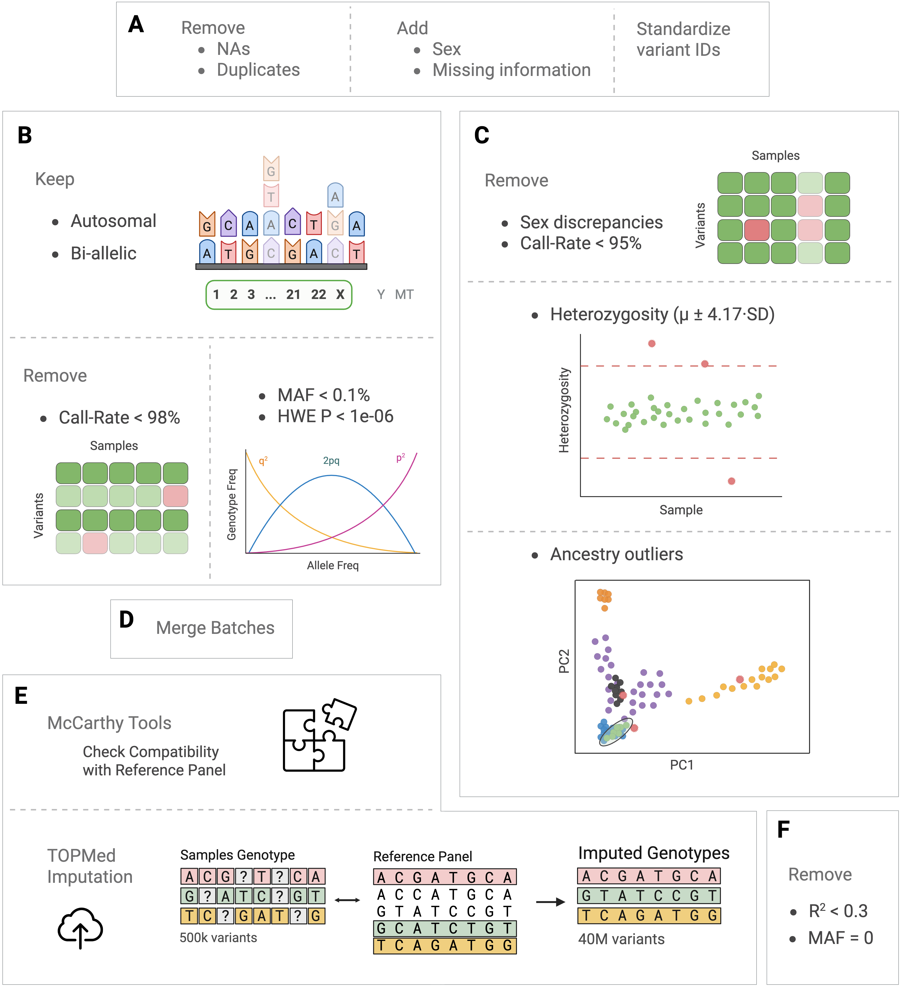

## GG-Impute

This is a genotype imputation pipeline I built during my [Master’s thesis](https://doi.org/10.5281/zenodo.21242279) at [IR Sant Pau](https://www.recercasantpau.cat/en/).

While working on my thesis, I needed to perform association analysis using raw array genotypes from a cohort genotyped in multiple batches. I couldn’t find a single comprehensive resource, so I ended up piecing together the information from various forums, guides, and documentation. As I ran my own imputation pipeline in the lab, I focused on making the process reproducible to ensure that current and future analyses in the group are consistent and more time-efficient.

I’ve documented every step and decision behind the pipeline here because I believe it can help others avoid the same obstacles and make the imputation process easier to approach. 

If you have any suggestions or ideas to improve this work, I would love to hear from you!

## Documentation

View the complete documentation of the imputation pipeline at: [GG-Impute](https://bioinumer.github.io/GG-Impute/).

  
   
  
    <strong>Genotype imputation pipeline.</strong> <strong>(A)</strong> Dataset pre-processing. <strong>(B)</strong> Variant-level quality control. <strong>(C)</strong> Sample-level quality control. <strong>(D)</strong> Merging of individually quality-controlled batches. <strong>(E)</strong> TOPMed imputation after verification of dataset’s format and compatibility using McCarthy tools. <strong>(F)</strong> Post-imputation quality control.
  

